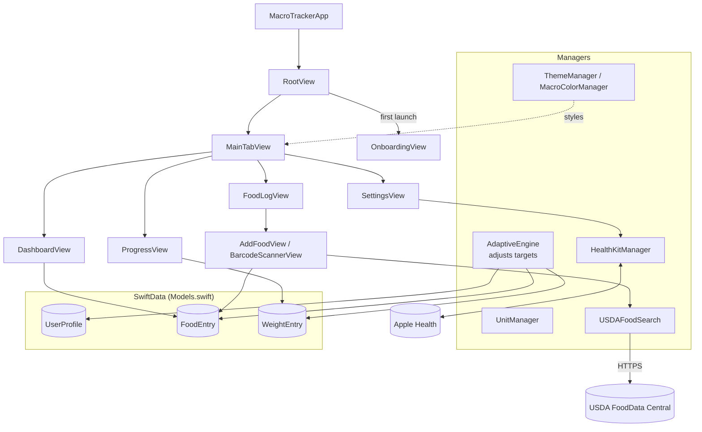

# Architecture

A SwiftUI + SwiftData iOS macro-tracking app (source in `Macro tracking - ios_swift/`).

```mermaid
flowchart TD
    App[MacroTrackerApp] --> Root[RootView]
    Root -->|first launch| Onb[OnboardingView]
    Root --> Tabs[MainTabView]
    Tabs --> Dash[DashboardView]
    Tabs --> Log[FoodLogView]
    Tabs --> Prog[ProgressView]
    Tabs --> Set[SettingsView]
    Log --> Add[AddFoodView / BarcodeScannerView]

    subgraph Managers
        Adapt[AdaptiveEngine<br/>adjusts targets]
        Theme[ThemeManager / MacroColorManager]
        Unit[UnitManager]
        HK[HealthKitManager]
        USDA[USDAFoodSearch]
    end

    subgraph SwiftData["SwiftData (Models.swift)"]
        UP[(UserProfile)]
        FE[(FoodEntry)]
        WE[(WeightEntry)]
    end

    Add --> USDA -->|HTTPS| USDAAPI[(USDA FoodData Central)]
    Add --> FE
    Dash --> FE
    Prog --> WE
    Adapt --> UP
    Adapt --> WE
    Adapt --> FE
    Set --> HK <--> Health[(Apple Health)]
    Theme -.styles.-> Tabs
```
